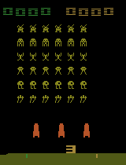
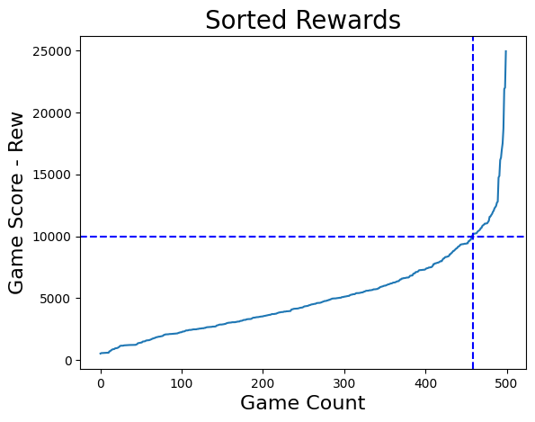
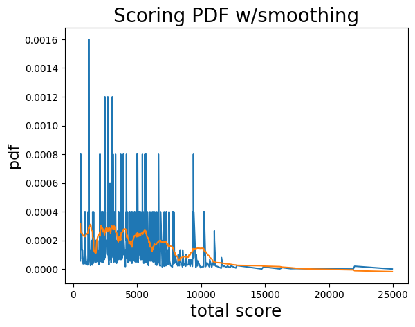
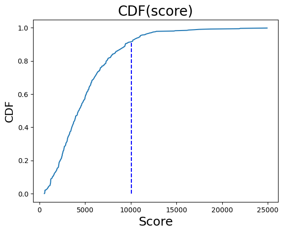

# Space Invaders Project Summary

I trained an AI Agent to play Atari’s Space Invaders.  The agent can get the score to roll over twice.  (The score rolls over when the score exceeds 9999.  This score rollover occurs every 16 levels, so the agent has completed the first 32 levels of the game when the score rolls over twice.  Like many Atari games Space Invaders has no final level.  It is possible to play the game indefinitely.  In practice my agent can reach as far as level 42 in its highest scoring game.)

My agent is self taught and plays Space Invaders using only the images shown on the screen.  The agent has no prior knowledge of the game and has learned to play through self play.  This is similar to what [Google’s Deepmind team did with Atari’s Breakout game](https://youtu.be/V1eYniJ0Rnk?si=MxJzxsX09T2sNEiW).

I am proud of what I accomplished and wanted to share my results.

## Results 

**High Score:** 24.9 k  (24,935)  

**Mean Score:** 5.0 k

**Median Score:** 4.3 k

**Difference between Mean and Median:** 0.22 std dev, ~1 game level

**Sample Size:** 500 Games 

**Std Dev:**   3.4 k

**Percentage Games Where Score Rolls Over:** 8.4%

**Percentage Games Where Score Rolls Over Twice:** 0.6%

 
Video of High Scoring Game:

## Agent Model 

This is a summary of how my agent chooses its Atari controller input for each frame of the game.

## Preprocessing Layers  
- Casting Images to Black and White
- Rescaling to Square Images
- Frame Stacking

### Casting Images to Black and White
The raw game images are taken as model input from the ALE (Atari Learning Environment) emulator.  The raw images are then cast from color images into black and white images.  The rational for the loss of color is that black and white images are faster to train on.  A black and white image can be respresented by a single number, but a colored RGB image is represented by three numbers.  Additionally, the color images do not carry any additional information so using black and white does not result in a loss in information.  

### Rescaling to Square Images
The images are then made square after being made black and white.  These square images also reduce model training time, because the agent does not need to learn that the images are rectangular when fitting certain multi-dimensional gaussian functions*.  

### Frame Stacking
Frame stacking is used to help the agent detect motion on the game screen.  A raw screenshot does not indicate velocity for objects in the image frame.  A short image history buffer is used to infer object motion.   This motion detection behavior is automatically learned by the next CNN Layer.  

The specifics of my framestacking scheme is to store and stack the last four images as a tensor.  These four images are the current image and three previous image.  Each image has a four frame spacing between images, images (N - 12, N - 8, N - 4, N).  This is the output that is piped into the next CNN layer.

## CNN (Convolution Neural Net) and Selecting Atari Controller Command 

The CNN layers accepts a stack of images as input and then performs self-taught feature extraction.  This feature extraction is performed by sliding a window across the stack of images and performing a convolution of the sub-image in that sliding window.  This convolved product, of the sub-image, forms the next image layer, which is then convolved again with a separate sliding window that belongs to the next convolutional layer.  This process is repeated several times.  

To achieve the final controller output, the final convolutional layer is flattened and passed through a dense, fully connected layer that maps the different extracted layers to Atari controller input probabilities.  (This is done with matrix multiplication of a weight matrix against the flattened feature vector CNN output.)  Some details are omitted for brevity.  The agent then chooses an action based on which probability has the highest chance of increasing the total score for the Space Invaders game.

## PPO Agent Training

[Please see this Open AI's announcement for details.](https://openai.com/index/openai-baselines-ppo/)

[Or read this thesis for even more technical details.](https://fse.studenttheses.ub.rug.nl/25709/1/mAI_2021_BickD.pdf)

## Python Modules Used for Project

Gymnasium: Provides API interface between the ALE Atari games and the RL package.
https://gymnasium.farama.org/

ALE (Atari Learning Environment): Provides the Atari Space Invades game with an API to assist with ML (machine learning).
https://ale.farama.org/

StableBaselines-3: Contains a library of reinforcement learning agents that can easily be connected to cloud compute resources allowing for easy training an gameplay.
https://stable-baselines3.readthedocs.io/en/master/index.html

## Project Costing

### Cloud Compute Costs

### Engineering Man Hours

# Additional Anaysis

## Agent Performance Plots

### AI Agent Score PDF

The dashed line indicates where game score roll over occurs.  The score rolls over when it exceeds 9999.

The orange curve is the smoothed PDF function.  The raw score jumps in increments of 5, 10, 15, 20, 25 and 30, which leads to a jagged PDF with many gaps making it harder to interpret.

### AI Agent Score CDF

